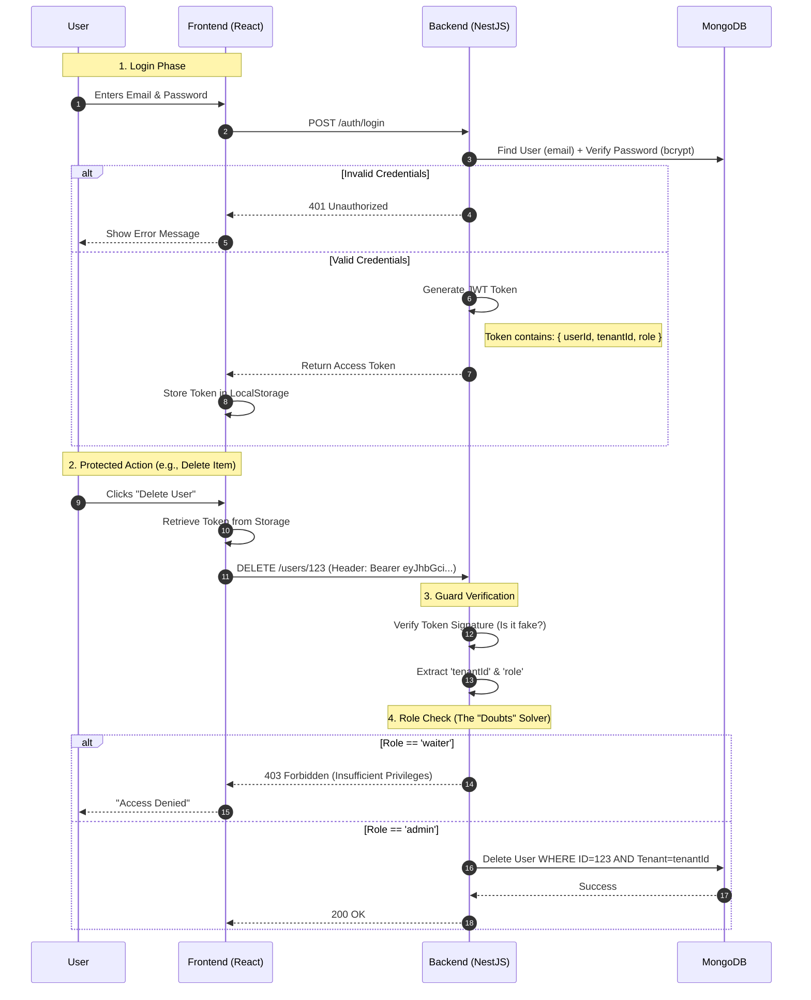
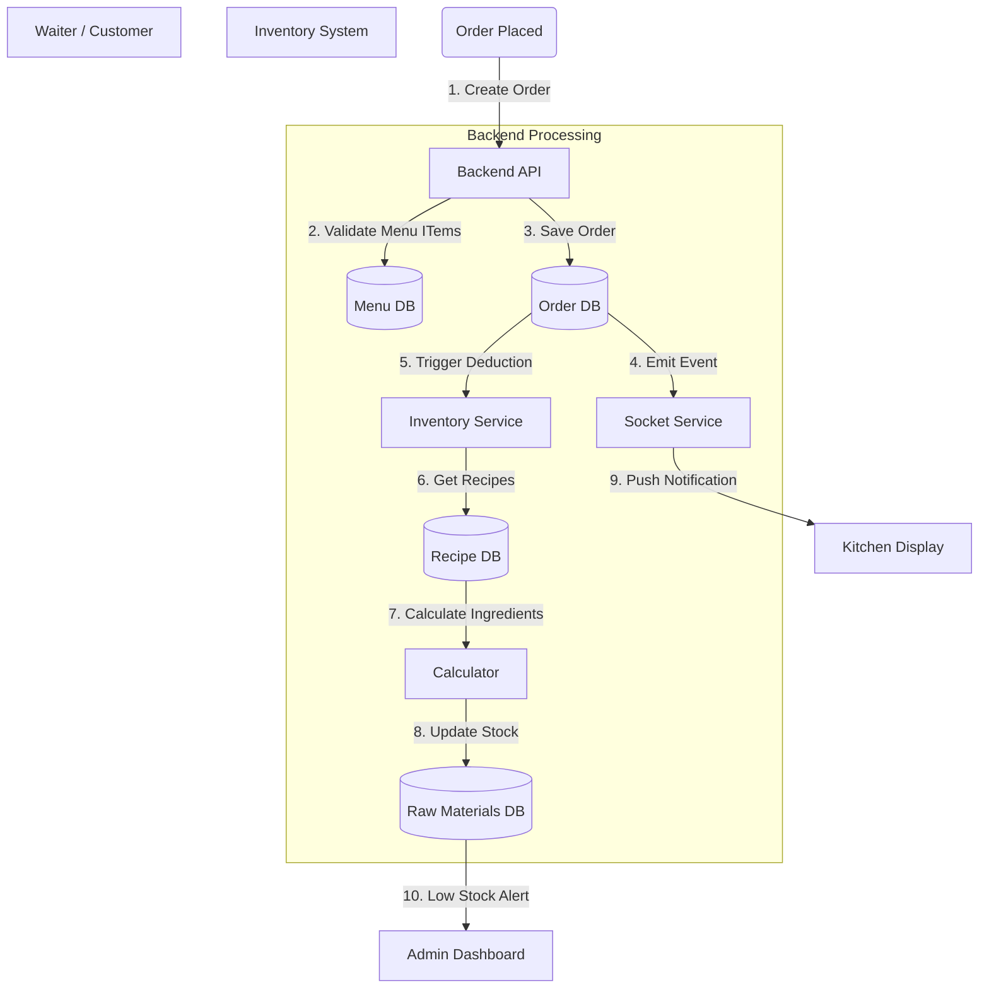

# End-to-End SaaS Architecture & Workflow

This document outlines the complete technical architecture and operational workflows of the Restaurant SaaS Application. It covers the connectivity, security (Role-Based Access Control), and business logic flows from the user interface down to the database.

---

## 1. System Topology (High-Level Architecture)

The system is built as a **Modular Monolith** using a layered architecture. It ensures scalability for multiple tenants (restaurants) while sharing a single codebase.

```mermaid
graph TD
    %% Clients
    User[End User / Guest]
    Staff[Restaurant Staff / Admin]
    Super[SaaS Superadmin]

    %% Frontend Layer
    subgraph "Frontend Layer (React + Vite)"
        Web[Web Browser]
        Mobile[Mobile App (Capacitor)]
        Store[Redux / Context API]
    end

    %% Communication Layer
    subgraph "Connectivity"
        REST[REST API (HTTPS)]
        WS[WebSockets (Socket.io)]
    end

    %% Backend Layer
    subgraph "Backend Layer (NestJS)"
        Gateway[API Gateway / Controllers]
        Auth[Auth Guard (JWT)]
        Modules[Feature Modules]
        
        subgraph "Core Modules"
            Tenants[Tenant Manager]
            Orders[Order Processing]
            Inventory[Inventory Engine]
        end
    end

    %% Data Layer
    subgraph "Infrastructure"
        DB[(MongoDB Cluster)]
        Cache[(Redis - Optional)]
        Ext[External APIs]
    end

    %% External Services
    Stripe[Stripe Payments]
    AWS[AWS S3 Storage]
    Email[AWS SES / SMTP]

    %% Connections
    User --> Web
    Staff --> Web
    Staff --> Mobile
    Web --> Store
    Store --> REST
    Store --> WS
    
    REST --> Gateway
    WS --> Gateway
    
    Gateway --> Auth
    Auth --> Modules
    
    Modules --> DB
    Modules --> Ext
    
    Ext --> Stripe
    Ext --> AWS
    Ext --> Email
```

---

## 2. Authentication & Security Workflow (RBAC)

This flow details how "Roles" and "Logins" work securely across the application. This resolves doubts about how a user is identified and restricted.

### The Security Pipeline
1.  **Identity**: "Who are you?" (Authentication)
2.  **Context**: "Which Restaurant (Tenant) do you belong to?" (Multi-tenancy)
3.  **Permission**: "Are you allowed to do this?" (Authorization)



---

## 3. Core Business Logic Workflows

### A. The "Order-to-Inventory" Lifecycle (End-to-End)
This demonstrates the connectivity between **Orders**, **Kitchen**, and **Inventory**.



### B. Multi-Tenant SaaS Isolation
How the system ensures Restaurant A cannot see Restaurant B's data.

*   **Middleware Strategy**:
    *   Every request must carry a **JWT**.
    *   The backend extracts `tenantId` from the JWT.
    *   **Automated Injection**: The Service layer automatically adds `.find({ tenant: request.user.tenantId })` to *every* database query.
    *   **Result**: complete data isolation without needing separate databases.

---

## 4. Technical Request Flow (The Code Path)

When a user interacts with the app, the code executes in this exact order:

1.  **React Component** (`pages/orders/OrderPage.tsx`)
    *   User clicks "Place Order".
    *   Calls `ordersAPI.create()`.
2.  **Axios Interceptor** (`services/api.ts`)
    *   Catches the request.
    *   Attaches `Authorization: Bearer <token>`.
3.  **NestJS Controller** (`modules/orders/orders.controller.ts`)
    *   Endpoint: `@Post('/')`.
    *   Decorator: `@UseGuards(JwtAuthGuard, RolesGuard)`.
    *   Decorator: `@Roles('admin', 'waiter')`.
4.  **NestJS Service** (`modules/orders/orders.service.ts`)
    *   Received validated data.
    *   Executes business logic (calculations, validation).
5.  **Mongoose Model** (`models/order.schema.ts`)
    *   Validates data types.
    *   Writes to MongoDB.
6.  **Response**:
    *   Data flows back up the chain to the React Component.
    *   UI updates (Toast message "Order Placed Successfully").

---

## 5. Deployment Architecture

To ensure high availability and responsiveness:

*   **Frontend**: Hosted on CDN (e.g., Vercel / Netlify / AWS CloudFront) for fast global access.
*   **Backend**: Hosted on Scalable Compute (AWS EC2 / ECS / DigitalOcean Droplets).
    *   Uses **PM2** to manage processes.
*   **Database**: MongoDB Atlas (Cloud Managed) with auto-scaling and backups.
*   **Storage**: AWS S3 for saving menu images and user avatars permanently.

